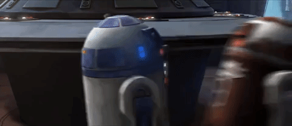
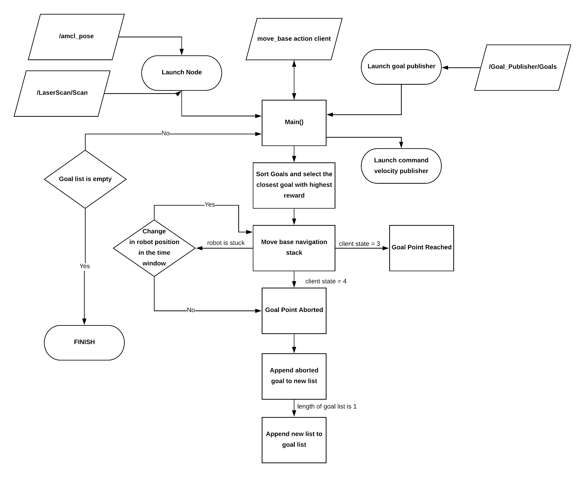

# R2 D2



**May the FORCE be with US**

This repository is part of the AAMR course, it contains codes to achieve the task of moving the robot in a gazebo environment to reach the goals by avoiding all the obstacles in the environment.

Launch command:

```
roslaunch r2_d2 start.launch robot_id:=robot1
```


## Getting started

This project consists of two main tasks which have to be accomplished by the robot:

1. To reach the goals published by /goals topic from goal_publisher package, in minimum time getting maximum rewards.

2. To avoid the obstacles while reaching these goal points.

This project can be started by achieving these tasks independently and then combining the codes to achieve the main task.
The prerequisites include:


Check if goals are being published when the topic /goals are published.
Good knowledge about ROS, Topics, Subscribers, Publishers.
Gazebo environment with obstacles.
A map.yaml file is required to get the map of the environment for navigation.

## General description
The goal of the project is to move the robot to reach as many goals as possible while avoiding all the obstacles in the environment.
Each goal has a reward associated with the point. The robot has to cover the goals to get the maximum number of these rewards and in the minimum number of times. 

The topics being used are:

/cmd_vel: To provide motion to the robot. The robot moves in the x-axis and rotates along the z-axis.

/amcl_pose: This is used to get the current position of the robot while in the environment.

/goals: This is used to get the goals to which the robot has to move.

/scan: This is used to get the Laser scan information.

/move_base: It is a navigation stack, which when given a point determines a path and navigates to the point, from the current robot position.


## Algorithm description


The algorithm has been designed in 5 states:

1. Getting goal points

2. Sorting goal points based on the current position of the robot which is provided by the amcl_pose topic.

3. Sending the goal point as a parameter to move_base to determine the path to the goal. 

4. The move_base navigates to the goal point. 

5. On reaching the goal point the reward has to be added and the next goal point has to be determined.

The first thing to be done after subscribing to the topics is to converge the particle cloud. This is done in the project by simply moving the robot around for 5 seconds. It is necessary that the particle cloud is properly converged in order to assure proper localization of the robot on the map.

After localization, the algorithm looks for a goal point closest to the robot and passes the point as an input to the move_base algorithm.

The move_base navigation stack navigates the robot from its current position to the goal position based on the cost maps. There may be situations where the move base determined path cannot be followed by the robot. In such conditions, the robot must abort the goal and move to the next goal. Along with this, another problem that may arise is the situation where the robot is stuck and cannot get out. These problems are tackled using a time window and recovery algorithm. 

The time window method checks for the error in the position of the robot for a certain time frame. If there is no significant change in the robot position. It will abort the goal and append it to a new list. 

In the case, where the robot is stuck, the algorithm calls for a function where it checks the laser scan values. The laser scan values can determine the region where there are no obstacles and thus the robot is oriented or moved towards the free region.

The algorithm continues to run on move_base and covers the goal points until the list is empty. The new list which contains the aborted goal has to be covered. There can be cases where a simple goal point is avoided because the robot is stuck in a congested area. In order to achieve these goals using move base the new list is appended to the goal list. The algorithm repeats this process 4 times and then aborts the remainig goals.

### Flowchart for the algorithm 



## Authored by :

1) Nishanth Nandakumar 32971
2) Shreya Nair 32930